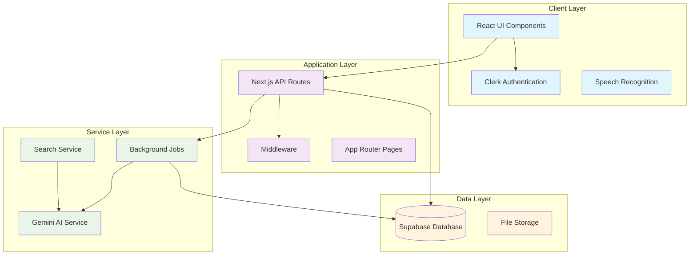

# Derplexity 🔍

A modern AI-powered search and emotion analysis platform inspired by Perplexity AI. Derplexity combines intelligent web search capabilities with emotion detection to provide comprehensive insights and answers to user queries.


## ✨ Features

- **🔍 AI-Powered Search**: Get intelligent answers with cited sources from across the web
- **😊 Emotion Analysis**: Analyze emotional content and sentiment in text
- **🎤 Voice Input**: Speech recognition for hands-free interaction
- **💬 Chat Interface**: Conversational UI for natural interactions
- **📚 Search Library**: Save and organize your search history
- **🔐 User Authentication**: Secure login and user management with Clerk
- **📱 Responsive Design**: Works seamlessly across desktop and mobile devices
- **🎨 Modern UI**: Beautiful interface built with shadcn/ui components

## 🏛️ Architecture Overview

Derplexity follows a modern microservices-inspired architecture built on Next.js with the following key components:



### Core Components

1. **Frontend (Next.js 15 + React 18)**
   - Server-side rendering for optimal performance
   - App Router for modern routing patterns
   - React Server Components for efficient data fetching

2. **Authentication Layer (Clerk)**
   - Secure user authentication and session management
   - Protected routes with middleware
   - User profile management

3. **API Layer (Next.js API Routes)**
   - RESTful endpoints for client-server communication
   - Background job triggers
   - Integration with external services

4. **Background Processing (Inngest)**
   - Asynchronous AI model processing
   - Reliable job execution with retries
   - Event-driven architecture

5. **Database Layer (Supabase)**
   - PostgreSQL database for data persistence
   - Real-time subscriptions
   - Row-level security

## 🔧 System Design

### Data Flow Architecture

```
┌─────────────┐    ┌──────────────┐    ┌─────────────┐    ┌─────────────┐
│   Client    │───▶│  Next.js API │───▶│   Inngest   │───▶│   Gemini    │
│   (React)   │    │   Routes     │    │  (Jobs)     │    │     AI      │
└─────────────┘    └──────────────┘    └─────────────┘    └─────────────┘
       │                   │                   │                   │
       │                   ▼                   ▼                   │
       │            ┌──────────────┐    ┌─────────────┐            │
       └───────────▶│   Supabase   │◀───│   Database  │◀───────────┘
                    │   Database   │    │   Updates   │
                    └──────────────┘    └─────────────┘
```

### Request Lifecycle

#### 1. Search Request Flow
```
User Input → ChatInputBox → API Route → Database Insert → Inngest Job → AI Processing → Database Update → Real-time UI Update
```

#### 2. Emotion Analysis Flow
```
User Input → Emotion Mode → API Route → Background Job → Sentiment Analysis → Response Generation → UI Display
```

### Database Schema

```sql
-- Core Tables Structure
┌─────────────────┐         ┌─────────────────┐
│     Library     │         │      Chats      │
├─────────────────┤         ├─────────────────┤
│ id (SERIAL)     │────┐    │ id (SERIAL)     │
│ libid (UUID)    │    │    │ libid (UUID)    │
│ searchInput     │    └───▶│ aiResp (TEXT)   │
│ userEmail       │         │ created_at      │
│ searchType      │         └─────────────────┘
│ created_at      │
└─────────────────┘
```

### Component Architecture

```
┌─────────────────────────────────────────────────────────────┐
│                        App Layout                           │
├─────────────────────────────────────────────────────────────┤
│ ┌─────────────┐ ┌─────────────────────────────────────────┐ │
│ │  Sidebar    │ │              Main Content               │ │
│ │             │ │ ┌─────────────────────────────────────┐ │ │
│ │ • Library   │ │ │          Page Content              │ │ │
│ │ • Discover  │ │ │                                     │ │ │
│ │ • Settings  │ │ │ ┌─────────────────────────────────┐ │ │ │
│ │             │ │ │ │       ChatInputBox              │ │ │ │
│ └─────────────┘ │ │ │ • Search Input                  │ │ │ │
│                 │ │ │ • Voice Recognition             │ │ │ │
│                 │ │ │ • Mode Selection               │ │ │ │
│                 │ │ └─────────────────────────────────┘ │ │ │
│                 │ └─────────────────────────────────────┘ │ │
│                 └─────────────────────────────────────────┘ │
└─────────────────────────────────────────────────────────────┘
```

### State Management

```typescript
// Global State Architecture
┌─────────────────┐
│   Clerk Auth    │ ← User authentication state
└─────────────────┘

┌─────────────────┐
│ UserDetailContext│ ← User profile data
└─────────────────┘

┌─────────────────┐
│ Component State │ ← Local UI state (React useState)
└─────────────────┘

┌─────────────────┐
│ Supabase Store  │ ← Server state (queries & mutations)
└─────────────────┘
```

### Security Architecture

1. **Authentication Security**
   - JWT tokens managed by Clerk
   - Secure session handling
   - Protected API routes

2. **API Security**
   - Middleware-based route protection
   - User context validation
   - Input sanitization

3. **Database Security**
   - Row-level security (RLS) in Supabase
   - User-scoped data access
   - Prepared statements for SQL injection prevention

4. **Environment Security**
   - Environment variables for sensitive data
   - API key rotation support
   - HTTPS enforcement

### Performance Optimizations

1. **Frontend Performance**
   - Next.js automatic code splitting
   - React Server Components
   - Image optimization with Next.js Image
   - Static generation where possible

2. **API Performance**
   - Background job processing for heavy operations
   - Database query optimization
   - Response caching strategies

3. **Database Performance**
   - Indexed queries on frequently accessed columns
   - Connection pooling
   - Query optimization

### Scalability Considerations

1. **Horizontal Scaling**
   - Stateless API design
   - Background job distribution
   - CDN integration for static assets

2. **Vertical Scaling**
   - Database connection pooling
   - Memory-efficient React components
   - Optimized bundle sizes

3. **Monitoring & Observability**
   - Error tracking integration ready
   - Performance monitoring capabilities
   - Database query analysis

## 📡 API Documentation

### Core Endpoints

#### Search API
```typescript
POST /api/search-api
Content-Type: application/json

Request Body:
{
  "searchInput": string,
  "searchType": "search" | "emotion",
  "userEmail": string,
  "libid": string
}

Response:
{
  "success": boolean,
  "data": SearchResult[],
  "message": string
}
```

#### LLM Model Integration
```typescript
POST /api/llm-model
Content-Type: application/json

Request Body:
{
  "searchInput": string,
  "searchResultWeb": SearchResult[],
  "recordId": string
}

Response:
{
  "inngestRunId": string,
  "status": "queued" | "running" | "completed"
}
```

#### Emotion Analysis
```typescript
POST /api/llm-model-emotion
Content-Type: application/json

Request Body:
{
  "searchInput": string,
  "recordId": string
}

Response:
{
  "inngestRunId": string,
  "emotionAnalysis": EmotionResult
}
```

#### Background Job Status
```typescript
GET /api/get-inngest-status?runId={inngestRunId}

Response:
{
  "status": "pending" | "running" | "completed" | "failed",
  "output": any,
  "error": string | null
}
```

### Background Jobs (Inngest Functions)

#### AI Model Processing
```typescript
// Function: llm-model
Event: "llm-model"
Purpose: Process search queries with AI and generate responses

Input:
{
  searchInput: string,
  searchResultWeb: SearchResult[],
  recordId: string
}

Steps:
1. AI inference with Gemini model
2. Response formatting
3. Database update
4. Error handling with retries
```

#### Emotion Analysis Processing
```typescript
// Function: emotion-analysis
Event: "emotion-analysis"
Purpose: Analyze emotional content and sentiment

Input:
{
  searchInput: string,
  recordId: string
}

Steps:
1. Sentiment analysis with AI
2. Emotion classification
3. Result storage
4. Notification dispatch
```

### Database Schema Details

#### Library Table
```sql
CREATE TABLE Library (
  id SERIAL PRIMARY KEY,
  libid UUID UNIQUE NOT NULL DEFAULT gen_random_uuid(),
  searchInput TEXT NOT NULL,
  userEmail TEXT NOT NULL,
  searchType VARCHAR(20) NOT NULL CHECK (searchType IN ('search', 'emotion')),
  created_at TIMESTAMP WITH TIME ZONE DEFAULT NOW(),
  updated_at TIMESTAMP WITH TIME ZONE DEFAULT NOW()
);

-- Indexes for performance
CREATE INDEX idx_library_user_email ON Library(userEmail);
CREATE INDEX idx_library_libid ON Library(libid);
CREATE INDEX idx_library_created_at ON Library(created_at DESC);
```

#### Chats Table
```sql
CREATE TABLE Chats (
  id SERIAL PRIMARY KEY,
  libid UUID NOT NULL REFERENCES Library(libid) ON DELETE CASCADE,
  aiResp TEXT,
  sources JSONB,
  metadata JSONB,
  created_at TIMESTAMP WITH TIME ZONE DEFAULT NOW(),
  updated_at TIMESTAMP WITH TIME ZONE DEFAULT NOW()
);

-- Indexes for performance
CREATE INDEX idx_chats_libid ON Chats(libid);
CREATE INDEX idx_chats_created_at ON Chats(created_at DESC);
```

#### Row Level Security (RLS)
```sql
-- Enable RLS
ALTER TABLE Library ENABLE ROW LEVEL SECURITY;
ALTER TABLE Chats ENABLE ROW LEVEL SECURITY;

-- Policies for user data access
CREATE POLICY "Users can only access their own library records" 
  ON Library FOR ALL 
  USING (userEmail = auth.jwt() ->> 'email');

CREATE POLICY "Users can only access their own chats" 
  ON Chats FOR ALL 
  USING (
    libid IN (
      SELECT libid FROM Library 
      WHERE userEmail = auth.jwt() ->> 'email'
    )
  );
```

## 🛠️ Tech Stack

- **Frontend**: [Next.js 15](https://nextjs.org/) with React 18
- **UI Components**: [shadcn/ui](https://ui.shadcn.com/) with Tailwind CSS
- **Authentication**: [Clerk](https://clerk.dev/)
- **Database**: [Supabase](https://supabase.com/)
- **Background Jobs**: [Inngest](https://www.inngest.com/)
- **AI Integration**: Google Gemini API
- **Speech Recognition**: Web Speech API
- **Icons**: [Lucide React](https://lucide.dev/)
- **Styling**: [Tailwind CSS](https://tailwindcss.com/)

## 🌐 Deployment Architecture

### Production Environment

```
┌─────────────────────────────────────────────────────────────┐
│                    Production Stack                         │
├─────────────────────────────────────────────────────────────┤
│                                                             │
│ ┌─────────────┐  ┌─────────────┐  ┌─────────────┐          │
│ │   Vercel    │  │   Supabase  │  │   Inngest   │          │
│ │   (Hosting) │  │ (Database)  │  │   (Jobs)    │          │
│ └─────────────┘  └─────────────┘  └─────────────┘          │
│        │                │                │                 │
│        └────────────────┼────────────────┘                 │
│                         │                                  │
│ ┌─────────────┐  ┌─────────────┐  ┌─────────────┐          │
│ │    Clerk    │  │   Gemini    │  │     CDN     │          │
│ │   (Auth)    │  │    (AI)     │  │  (Assets)   │          │
│ └─────────────┘  └─────────────┘  └─────────────┘          │
└─────────────────────────────────────────────────────────────┘
```

### Environment Configuration

#### Development
```yaml
Environment: development
Database: Supabase (Development)
Authentication: Clerk (Development)
Background Jobs: Inngest (Development)
AI: Gemini API (Development quota)
Hosting: Local (localhost:3000)
```

#### Staging
```yaml
Environment: staging
Database: Supabase (Staging)
Authentication: Clerk (Staging)
Background Jobs: Inngest (Staging)
AI: Gemini API (Staging quota)
Hosting: Vercel Preview
```

#### Production
```yaml
Environment: production
Database: Supabase (Production)
Authentication: Clerk (Production)
Background Jobs: Inngest (Production)
AI: Gemini API (Production quota)
Hosting: Vercel Production
CDN: Vercel Edge Network
Monitoring: Built-in Vercel Analytics
```

### Infrastructure as Code

#### Vercel Configuration
```json
// vercel.json
{
  "framework": "nextjs",
  "buildCommand": "npm run build",
  "devCommand": "npm run dev",
  "installCommand": "npm install",
  "env": {
    "NEXT_PUBLIC_CLERK_PUBLISHABLE_KEY": "@clerk_publishable_key",
    "CLERK_SECRET_KEY": "@clerk_secret_key",
    "NEXT_PUBLIC_SUPABASE_URL": "@supabase_url",
    "NEXT_PUBLIC_SUPABASE_KEY": "@supabase_anon_key",
    "NEXT_PUBLIC_GEMINI_API_KEY": "@gemini_api_key",
    "INNGEST_EVENT_KEY": "@inngest_event_key",
    "INNGEST_SIGNING_KEY": "@inngest_signing_key"
  },
  "regions": ["iad1"],
  "functions": {
    "app/api/inngest/route.ts": {
      "maxDuration": 300
    }
  }
}
```

#### Database Migrations
```sql
-- Migration script for production setup
-- migrations/001_initial_schema.sql

-- Enable UUID extension
CREATE EXTENSION IF NOT EXISTS "uuid-ossp";

-- Create enum for search types
CREATE TYPE search_type_enum AS ENUM ('search', 'emotion');

-- Create tables with proper constraints
CREATE TABLE Library (
  id SERIAL PRIMARY KEY,
  libid UUID UNIQUE NOT NULL DEFAULT uuid_generate_v4(),
  searchInput TEXT NOT NULL CHECK (length(searchInput) > 0),
  userEmail TEXT NOT NULL CHECK (userEmail ~ '^[^@]+@[^@]+\.[^@]+$'),
  searchType search_type_enum NOT NULL,
  created_at TIMESTAMP WITH TIME ZONE DEFAULT NOW(),
  updated_at TIMESTAMP WITH TIME ZONE DEFAULT NOW()
);

CREATE TABLE Chats (
  id SERIAL PRIMARY KEY,
  libid UUID NOT NULL REFERENCES Library(libid) ON DELETE CASCADE,
  aiResp TEXT,
  sources JSONB DEFAULT '[]'::jsonb,
  metadata JSONB DEFAULT '{}'::jsonb,
  processing_status VARCHAR(20) DEFAULT 'pending',
  created_at TIMESTAMP WITH TIME ZONE DEFAULT NOW(),
  updated_at TIMESTAMP WITH TIME ZONE DEFAULT NOW()
);

-- Create indexes
CREATE INDEX CONCURRENTLY idx_library_user_email_created ON Library(userEmail, created_at DESC);
CREATE INDEX CONCURRENTLY idx_library_search_type ON Library(searchType);
CREATE INDEX CONCURRENTLY idx_chats_libid_status ON Chats(libid, processing_status);
CREATE INDEX CONCURRENTLY idx_chats_created_at ON Chats(created_at DESC);

-- Enable RLS
ALTER TABLE Library ENABLE ROW LEVEL SECURITY;
ALTER TABLE Chats ENABLE ROW LEVEL SECURITY;

-- RLS Policies
CREATE POLICY "library_user_isolation" ON Library
  FOR ALL USING (userEmail = current_setting('request.jwt.claims')::json->>'email');

CREATE POLICY "chats_user_isolation" ON Chats
  FOR ALL USING (
    libid IN (
      SELECT libid FROM Library 
      WHERE userEmail = current_setting('request.jwt.claims')::json->>'email'
    )
  );
```

### Monitoring & Observability

#### Application Monitoring
```typescript
// lib/monitoring.ts
export const monitoring = {
  // Error tracking
  captureException: (error: Error, context?: any) => {
    // Integration with error tracking service
    console.error('Application Error:', error, context);
  },
  
  // Performance monitoring
  trackPageView: (page: string) => {
    // Analytics integration
  },
  
  // Custom metrics
  trackSearchQuery: (searchType: string, duration: number) => {
    // Custom metrics tracking
  }
};
```

#### Health Checks
```typescript
// app/api/health/route.ts
export async function GET() {
  const healthChecks = {
    database: await checkSupabaseConnection(),
    ai: await checkGeminiAPI(),
    inngest: await checkInngestConnection(),
    timestamp: new Date().toISOString()
  };
  
  const isHealthy = Object.values(healthChecks).every(check => 
    typeof check === 'boolean' ? check : true
  );
  
  return Response.json(healthChecks, { 
    status: isHealthy ? 200 : 503 
  });
}
```

## 🚀 Getting Started

### Prerequisites

- Node.js 18+ and npm/yarn/pnpm
- Supabase account and project
- Clerk account for authentication
- Google Gemini API key
- Inngest account (for background jobs)

### Installation

1. **Clone the repository**
   ```bash
   git clone https://github.com/yourusername/derplexity.git
   cd derplexity
   ```

2. **Install dependencies**
   ```bash
   npm install
   # or
   yarn install
   # or
   pnpm install
   ```

3. **Set up environment variables**
   
   Create a `.env.local` file in the root directory:
   ```env
   # Clerk Authentication
   NEXT_PUBLIC_CLERK_PUBLISHABLE_KEY=your_clerk_publishable_key
   CLERK_SECRET_KEY=your_clerk_secret_key
   NEXT_PUBLIC_CLERK_SIGN_IN_URL=/sign-in
   NEXT_PUBLIC_CLERK_SIGN_UP_URL=/sign-up

   # Supabase
   NEXT_PUBLIC_SUPABASE_URL=your_supabase_url
   NEXT_PUBLIC_SUPABASE_KEY=your_supabase_anon_key

   # AI Integration
   NEXT_PUBLIC_GEMINI_API_KEY=your_gemini_api_key

   # Inngest
   INNGEST_EVENT_KEY=your_inngest_event_key
   INNGEST_SIGNING_KEY=your_inngest_signing_key
   ```

4. **Set up Supabase database**
   
   Create the following tables in your Supabase project:
   ```sql
   -- Library table for storing search queries
   CREATE TABLE Library (
     id SERIAL PRIMARY KEY,
     libid UUID UNIQUE NOT NULL,
     searchInput TEXT NOT NULL,
     userEmail TEXT NOT NULL,
     searchType TEXT NOT NULL,
     created_at TIMESTAMP DEFAULT NOW()
   );

   -- Chats table for storing AI responses
   CREATE TABLE Chats (
     id SERIAL PRIMARY KEY,
     libid UUID REFERENCES Library(libid),
     aiResp TEXT,
     created_at TIMESTAMP DEFAULT NOW()
   );
   ```

5. **Run the development server**
   ```bash
   npm run dev
   # or
   yarn dev
   # or
   pnpm dev
   ```

6. **Open your browser**
   
   Navigate to [http://localhost:3000](http://localhost:3000) to see the application.

## 🏗️ Project Structure

```
derplexity/
├── app/                          # Next.js App Router
│   ├── (auth)/                   # Authentication routes
│   │   ├── sign-in/              # Sign in page
│   │   └── sign-up/              # Sign up page
│   ├── (routes)/                 # Protected routes
│   │   ├── discover/             # Discovery page
│   │   ├── emotion/[libid]/      # Emotion analysis results
│   │   ├── library/              # Search history
│   │   └── search/[libid]/       # Search results
│   ├── api/                      # API routes
│   │   ├── llm-model/            # AI model integration
│   │   ├── search-api/           # Search functionality
│   │   └── inngest/              # Background job webhook
│   ├── globals.css               # Global styles
│   ├── layout.tsx                # Root layout
│   └── page.tsx                  # Home page
├── components/                   # React components
│   ├── ui/                       # shadcn/ui components
│   ├── AppSidebar.tsx            # Application sidebar
│   ├── ChatInputBox.tsx          # Main search interface
│   └── SpeechRecognition.tsx     # Voice input component
├── context/                      # React context providers
├── hooks/                        # Custom React hooks
├── inngest/                      # Background job functions
├── lib/                          # Utility functions
├── services/                     # External service integrations
└── public/                       # Static assets
```

## 🎯 Usage

### Basic Search
1. Enter your query in the search box on the home page
2. Select "Search" mode for web search or "Emotion" mode for emotion analysis
3. Click the search button or press Enter
4. View AI-generated responses with cited sources

### Voice Input
1. Click the microphone icon in the search box
2. Speak your query clearly
3. The speech will be automatically transcribed to text

### Search Library
1. Navigate to the Library page from the sidebar
2. View your search history and previous results
3. Click on any previous search to view the results again

## 🔧 Configuration

### AI Model Configuration
The application uses Google Gemini for AI responses. You can modify the model settings in `inngest/function.ts`:

```typescript
model: step.ai.models.gemini({
  model: "gemini-1.5-flash", // Change model version here
  apiKey: process.env.NEXT_PUBLIC_GEMINI_API_KEY,
})
```

### UI Customization
The project uses shadcn/ui components. You can customize the theme in `app/globals.css` and component configurations in `components.json`.

## 🚀 Deployment

### Vercel (Recommended)
1. Push your code to GitHub
2. Connect your repository to Vercel
3. Add environment variables in Vercel dashboard
4. Deploy automatically

### Other Platforms
The application can be deployed on any platform that supports Next.js:
- Netlify
- Railway
- Render
- AWS Amplify

## 🤝 Contributing

Contributions are welcome! Please feel free to submit a Pull Request. For major changes, please open an issue first to discuss what you would like to change.

1. Fork the project
2. Create your feature branch (`git checkout -b feature/AmazingFeature`)
3. Commit your changes (`git commit -m 'Add some AmazingFeature'`)
4. Push to the branch (`git push origin feature/AmazingFeature`)
5. Open a Pull Request

## 📝 License

This project is licensed under the MIT License - see the [LICENSE](LICENSE) file for details.

## 🙏 Acknowledgments

- [Perplexity AI](https://perplexity.ai) for inspiration
- [shadcn/ui](https://ui.shadcn.com/) for beautiful UI components
- [Clerk](https://clerk.dev/) for authentication
- [Supabase](https://supabase.com/) for database services
- [Inngest](https://www.inngest.com/) for background job processing

## 📧 Contact

If you have any questions or suggestions, feel free to reach out or open an issue on GitHub.

---

Built with ❤️ using Next.js and modern web technologies.
